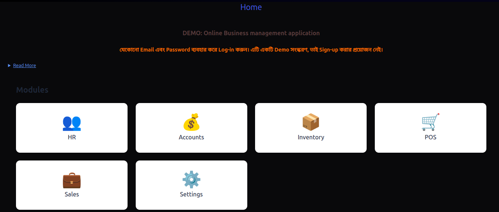

<a name="readme-top"></a>

# Business-Management - React Frontend


A modern React frontend application for Al Baik Restaurant and Community Centre management system, featuring dashboard analytics, POS, inventory management, and more.

<div align="center">
  
</div>

# 📗 Table of Contents

- [📖 About the Project](#about-project)
  - [🛠 Built With](#built-with)
  - [Key Features](#key-features)
  - [🛠 Tech Stack](#tech-stack)
- [💻 Getting Started](#getting-started)
  - [Setup](#setup)
  - [Prerequisites](#prerequisites)
- [👥 Authors](#authors)
- [👥 Video walk through](https://drive.google.com/drive/folders/1Z15ctH1xsSom5QCqVZdPDAtR6ziwEdjW?usp=drive_link)
- [🚀Live Demo](https://the-faizmohammad.github.io/Capstone-API-based-webapp/dist/)
- [🔭 Future Features](#future-features)
- [🤝 Contributing](#contributing)
- [⭐️ Show your support](#support)
- [🙏 Acknowledgements](#acknowledgements)
- [❓ FAQ](#faq)
- [📝 License](#license)

<!-- PROJECT DESCRIPTION -->

# 🎯 Business-Management Webapp <a name="about-project"></a>

A modern React frontend application for Restaurant and Community Centre management system, featuring dashboard analytics, inventory management, sales, POS, accounts.

## 🛠 Built With <a name="built-with"></a>

### Tech Stack <a name="tech-stack"></a>

<details>
  <summary>Technology</summary>
  <ul>
    <li><a href="https://reactjs.org/"></a></li>
    <li>React Router Dom</li>
    <li><a href="https://tailwindcss.com/"></a></li>
    <li>CSS-flex</li>
    <li>CSS-grid</li>
    <li>CSS</li>
  </ul>
</details>

<details>
  <summary>Tools</summary>
  <ul>
    <li>Code Editor</li>
    <li>GIT</li>
    <li>GITHUB</li>
    <li>GITHUB-Project</li>
  </ul>
</details>

<!-- Features -->

### 🚀 Key Features <a name="key-features"></a>

- **Dashboard Analytics**: Real-time summary cards and interactive charts
- **Sales**: Track sales data, update, delete
- **Point of Sale (POS)**: Streamlined order processing
- **Inventory Management**: Track stock levels and consumption
- **HR Module**: Employee management system
- **Responsive Design**: Works on all device sizes
- **Form Validation**: Robust form handling with Formik & Yup
- **Notification System**: Toast notifications for user feedback

**Modules:**
- Inventory
- Sales
- POS
- Accounts
- HR
- Auth

<p align="right">(<a href="#readme-top">back to top</a>)</p>

<!-- LIVE DEMO -->

## 🚀 Live Demo <a name="live-demo"></a>

- [Live Demo Link](https://c7c9161b.warehouse-frontend-btm.pages.dev/)
- [Video description](): Coming soon

<p align="right">(<a href="#readme-top">back to top</a>)</p>

## 📦 Project Structure

```bash
src/
├── components/         # Reusable UI components
│   ├── Home/           # Home page components
│   ├── Nav/            # Navigation components
│   ├── Shared/         # Shared UI components
│   └── Footer.jsx      # Footer component
│
├── modules/            # Business logic modules
│   ├── Dashboard/      # Dashboard components
│   ├── accounts/       # Accounting features
│   ├── hr/             # Human resources
│   ├── inventory/      # Inventory management
│   ├── pos/            # Point of Sale system
│   ├── sales/          # Sales tracking
│   └── settings/       # Application settings
│
├── data/               # Data files and schemas
│   └── schemas/        # Validation schemas
│
└── (other root files)  # App.js, main.js, etc.

<!-- GETTING STARTED -->

💻 Getting Started <a name="getting-started"></a>


To get a local copy up and running follow these simple example steps.

### Prerequisites

you have to those tools in your local machine.

- [ ] NPM
- [ ] GIT & GITHUB
- [ ] Any Code Editor (VS Code, Brackets, etc)

## 🧩 Key Dependencies

- [React](https://reactjs.org)
- [Tailwind CSS](https://tailwindcss.com)
- [Formik & Yup](https://formik.org) (Forms & Validation)
- [Recharts](https://recharts.org) (Data Visualization)
- [Lucide Icons](https://lucide.dev) (Icon Library)
- [React Toastify](https://fkhadra.github.io/react-toastify) (Notifications)


## 🛠  Setup

1. Clone the repository:
   ```bash
   git clone git@github.com:HossainAraf/albaik_frontend.git
     or
     git clone https://github.com/HossainAraf/albaik_frontend.git

   cd al-baik-restaurant
   ```

2. Install dependencies:
   ```bash
   npm install
   ```

3. Run the development server:
   ```bash
   npm start
   ```

4. Fix linting issues:
   ```bash
   npx eslint "**/*.{js,jsx}" --fix
   npx stylelint "**/*.{css,scss}" --fix
   ```

Runs the app in the development mode.\
Open [http://localhost:3000](http://localhost:3000) (or any other port) to view it in your browser.

The page will reload when you make changes.You may also see any lint errors in the console.

```bash
  npm test
```

```bash
  npm run build
```

## Learn More

You can learn more in the [Create React App documentation](https://facebook.github.io/create-react-app/docs/getting-started).

To learn React, check out the [React documentation](https://reactjs.org/).

<p align="right">(<a href="#readme-top">back to top</a>)</p>

<!-- AUTHORS -->

## 👥 Authors <a name="authors"></a>


👤 **Imrul Hasan**

- GitHub: <a href="https://github.com/imrulhasan-official">Imrul Hasan </a>
<!-- - LinkedIn: <a href="https://linkedin.com/in/"> Imrul Hasan </a> --> 

👤 **Md Arafat Hossain**

- GitHub: <a href="https://github.com/HossainAraf">HossainAraf </a>
- LinkedIn: <a href="https://www.linkedin.com/in/md-arafat-hossain-a39398379/"> Md. Arafat Hossain </a>

<p align="right">(<a href="#readme-top">back to top</a>)</p>

## 🔭 Future Features <a name="future-features"></a>

- [ ] **We will implement API data for all continents**  
- [ ] **We will implement payment getways**
- [ ] **Authentication**
- [ ] **Add Admin module**
- [ ] **Add Sales return**


<p align="right">(<a href="#readme-top">back to top</a>)</p>

<!-- CONTRIBUTING -->

## 🤝 Contributing <a name="contributing"></a>


- 📧 Email: [utechdynamic@gmail.com](mailto:utechdynamic@gmail.com)
- 📧 Email: [ImrulHasan](mailto:imrul.hasan.official@gmail.com)
- 📱 WhatsApp: [+880 1745-744312](https://wa.me/8801745-744312)
- 📱 WhatsApp: [+880 1737-378258](https://wa.me/8801737378258)
- OR open an [issue](https://github.com/HossainAraf/albaik_frontend/issues/new) to discuss

Feel free to check the [issues page](https://github.com/HossainAraf/albaik_frontend/issues/new)

Please follow these steps:
1. Contact us for permission
2. Fork the project
3. Create your feature branch (`git checkout -b feature/AmazingFeature`)
4. Commit your changes (`git commit -m 'Add some AmazingFeature'`)
5. Push to the branch (`git push origin feature/AmazingFeature`)
6. Open a Pull Request

<p align="right">(<a href="#readme-top">back to top</a>)</p>

<!-- SUPPORT -->

## 👋 Show your support <a name="support"></a>

Give a ⭐️ if you like this project!

<p align="right">(<a href="#readme-top">back to top</a>)</p>

<!-- ACKNOWLEDGEMENTS -->

## 🔭Acknowledgments <a name="acknowledgements"></a>

- Our Families.
- Microverse for standard guidance
- All code reviewers and collaborators
- The React community for amazing resources

<p align="right">(<a href="#readme-top">back to top</a>)</p>

<!-- FAQ (optional) -->

## ❓ FAQ <a name="faq"></a>

- **Are you using database?**

  - No, We are currently not using any database. PostgreSQL with Rails api will be added soon

- **Can I use this project for personal use?**

  - Yes, you can use it. But [Please Contact us for permission](#contributing)  <!-- Nedd to fix -->
    
<p align="right">(<a href="#readme-top">back to top</a>)</p>

## 📝 License <a name="license"></a>

This project is licensed under the MIT License - see the [LICENSE](./LICENSE) file for details.

<p align="right">(<a href="#readme-top">back to top</a>)</p>


